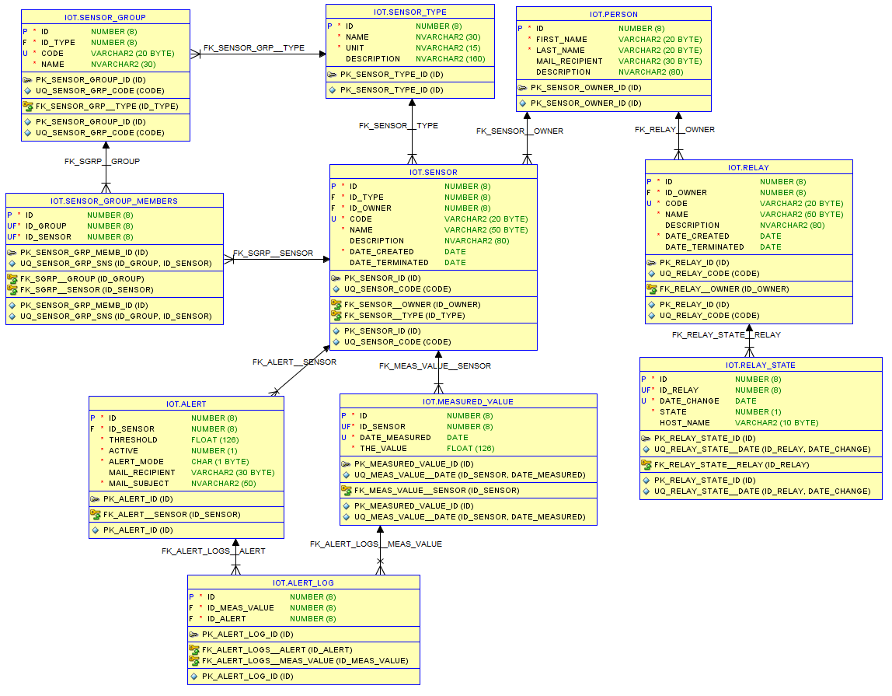

# ThreadWeb

### Модули
#### Account
Авторизация пользователей
#### API-Gateway
Работа с запросами пользотвалей
#### COAP
Полуение данных от дачиков

### Спецификация
 
1 Левое меню
- Dashboard (Мониторинг имеющихся данных)
  - Добавить виджет
    - Имя виджета
    - Источник данных
    - Тип виджета
      - Таблица
      - График
  - Удалить виджет
  - Редактировать виджет
- Devices
  - Добавить устройство
    - Получить token для устройства
  - Таблица устройств
    - Device ID
    - Device Name
    - Last contact
    - Tag
  - Уведомления
    - Email
    - SMS
    - Message
  - Задания
    - Триггеры
    - Jobs
  - Пользователи
    - Список пользователей
      - Права пользователей